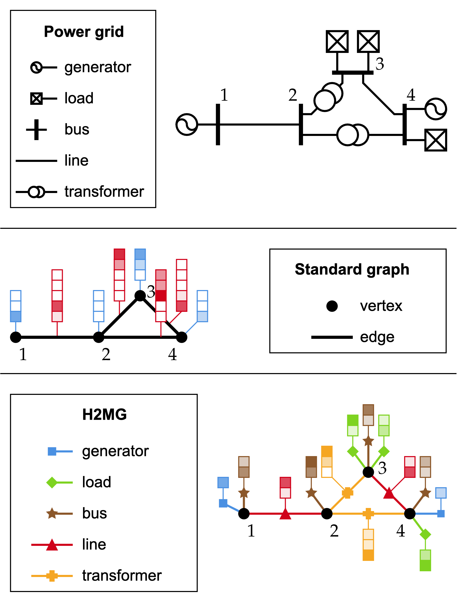
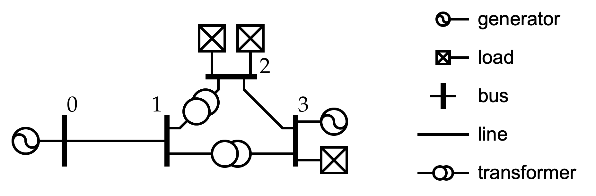

.. _data-formalism:

Power Grid Data Formalism
=========================

In this section, we detail the data formalism used throughout the package.

Limits of vectorization
-----------------------

Early work on the application of machine learning to power systems relied on  vectorizing the power grid data.
This was required because most machine learning techniques were designed to work on vector data of constant sizes.

By doing so, people made the implicit assumption that the grid structure was the same in every sample
of the dataset :

    - Same amount of buses, generators, loads, lines, etc. throughout the dataset ;
    - Same object naming and ordering ;
    - Same interconnection patterns.

Unfortunately, none of those assumption actually hold in real-life power grid data.

Limits of standard graphs
-------------------------

In order to account for the above-mentioned limitations, recent work focused on the use of Graph Neural Networks.
This allowed to work with data that have a varying amount of objects,
that may be ordered differently from one sample to another, and that can have varying interconnection patterns.

Still, this required to represent power grids as standard graphs, essentially made of vertices and edges.
While this is far better than vectorizing power grids, it still requires a preprocessing step to transform the
power grid into a graph composed of vertices and edges.

Now, let's say that you want to predict actions that should be applied to shunts.
Since shunts are only connected to one bus, you include the shunt in the node features.
Imagine that you have two shunts connected to the same bus : you have to merge them into a single
virtual object to fit your graph formalism. But controlling two distinct shunts is not equivalent to
controlling a twice as large shunt. By making this modelling choice, you are actually hindering your
data.

Hyper-Heterogeneous Multi Graphs
--------------------------------

Still, it is possible to represent power grids in a more natural way, which requires no preprocessing
that would degrade the data structure.

Instead of considering vertices and edges, we are now considering hyper-edges and addresses.
Hyper-edges are a generalization of edges : they can be connected to a various amount of addresses.
In our formalism, only hyper-edges bear features, while addresses only serve as interfaces
between hyper-edges.

A power grid is composed of multiple classes of hyper-edges : buses, lines, loads, etc.
All hyper-edges that belong to the same class have :

    - the same order (i.e. are connected to the same amount of addresses). For instance all transmission
      lines are connected to exactly two addresses, generators are all connected to a single address, etc.
    - the same features. For instance, all loads have a feature that define their active power consumption,
      their reactive power consumption, etc.

In addition, we allow multiple objects of the same class to have the same address. You may now consider
multiple generators connected to the same bus, or multiple transmission lines.

To sum things up, power grids actually are Hyper-Heterogeneous Multi Graphs (H2MGs) :

    - Hyper-graphs: Graphs that have hyper-edges, which can be connected to any number of vertices.
    - Heterogeneous graphs:Graphs that are made of multiple classes of objects.
    - Multi-graphs: Graphs that allow multiple objects to have the same addresses.

    Power grid instance and its conversions into a standard graph, and into a H2MG.
    Standard graphs require to aggregate together vertex-like objects on the one hand
    and edge-like objects on the other hand.
    Meanwhile, H2MG allow to seamlessly represent power grids, without any information loss.
    In this example, there are five classes of objects : generators, loads, buses, lines and
    transformers. The first three are of order 1, and the last two are of order 2.

Mathematical formalism
----------------------

In the following, we introduce notations that allow to describe power grids as H2MGs.
These notations will be especially useful for our graph neural network implementation, namely the
:ref:`Hyper Heterogeneous Multi Graph Neural Ordinary Differential Equation (H2MGNODE) <h2mgnode>`.

Hyper-edges and classes
_______________________

Let :math:`n \in \mathbb{N}`, and :math:`\mathcal{C}` be the set of considered classes.
We denote by :math:`\mathcal{E}^c` the set of hyper-edges of class :math:`c \in \mathcal{C}`.

Ports and Order
_______________

Each hyper-edge can be connected with other hyper-edges by sharing the same address.
Objects of the same class have the same "ports", and each port can be connected to different addresses.
For instance, in the case of transformers, we have the "high voltage" side and the "low voltage" side.
These two cannot be swapped, and are distinct ports for the class "transformer".

For a given class :math:`c`, we denote by :math:`\mathcal{O}^c` its set of ports, which associate each hyper-edge
with an address.

.. math::

    \forall c \in \mathcal{C}, \forall o \in \mathcal{O}^c, o : \mathcal{E}^c \rightarrow \{1, \dots, n\}

We call "order" of a class :math:`c` the cardinality of :math:`\mathcal{O}^c`.
In other words, the order of a class is the amount of ports of hyper-edges of a certain class.

    - Classes such that :math:`|\mathcal{O}^c| = 1` represent objects that are located at exactly one vertex
      (such as generators or loads).
    - Classes such that :math:`|\mathcal{O}^c| = 2` represent objects that are located at exactly two vertices
      (such as transmission lines or transformers in power grids).

Multi objects
_____________

In our notations, it is completely possible to have two hyper-edges :math:`e \neq e' \in \mathcal{E}^c`
that still share the exact same address : :math:`\forall o \in \mathcal{O}^c, o(e)=o(e')`.
Those two hyper-edges may share the same addresses, they may still bear different numerical features.
The H2MG formalism does not aggregate them together.

Structure
_________

One can define the notion of neighborhood of address :math:`i` as follows:

.. math::

    \mathcal{N}(i) = \{(c,e,o) | c \in \mathcal{C}, e \in \mathcal{E}^c, o \in \mathcal{O}^c, o(e)=i\}

This notion of neighborhood provides for each address :math:`i`:

    - The class of the hyper-edge that is connected to :math:`i`,
    - The hyper-edge that is connected to :math:`i`,
    - The port through which the hyper-edge is connected to :math:`i`.

This notion of neighborhood will prove especially handy for our
:ref:`Hyper Heterogeneous Multi Graph Neural Ordinary Differential Equation (H2MGNODE) <h2mgnode>` formulation.

Features
________

Contrarily to standard graphs, H2MGs exclusively bear features at hyper-edges:
vertices only play the role of addresses to which hyper-edges can be connected.
In that sense, vertices should be seen as an interface between hyper-edges.
The corresponding graph data can still be written as :math:`(x, y)` where :math:`x`
is the input and :math:`y` the output.

.. math::

    x = (x_{e}^c)_{c \in \mathcal{C}, e \in \mathcal{E}^c} \\
    y = (y_{e}^c)_{c \in \mathcal{C}, e \in \mathcal{E}^c}

Numerical Representation
------------------------

Now that the mathematical definition of H2MGs has been introduced, we may now proceed to show how
they are implemented in our library.
Let us consider the power grid shown in the figure below.

It is composed of multiple classes of hyper-edges : `bus`, `gen`, `load`, `line`
and `trafo`. The first three of them are of order 1 (i.e. are only connected
to one address), while the last two are of order 2 (i.e. are connected to two
addresses).

Both addresses and numerical features are contained in an object called `x`.
It is a nested dictionary :
upper level keys correspond to the object class, while the lower level key
corresponds to the name of the address / feature.

.. code-block:: pycon

    >>> x['bus']
    {'id': [0, 1, 2, 3]}
    >>> x['load']
    {'bus_id': [2, 2, 3], 'p_mw': [12.3, 45.6, 78.9], 'q_mvar': [1.23, 4.56, 7.89]}
    >>> x['gen']
    {'bus_id': [0, 3]}
    >>> x['line']
    {'from_bus_id': [0, 2], 'to_bus_id': [1, 3], 'r': [0.01, 0.02], 'x': [0.03, 0.04]}
    >>> x['trafo']
    {'high_voltage_bus_id': [1, 1], 'low_voltage_bus_id': [2, 3], 'x': [0.03, 0.04], 'tau':[1.01, 0.9]}
