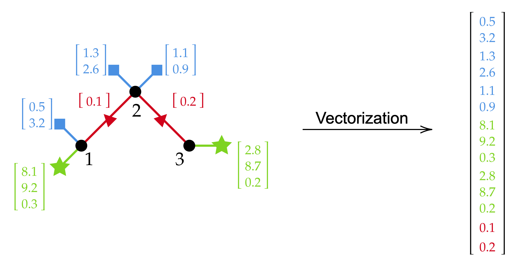
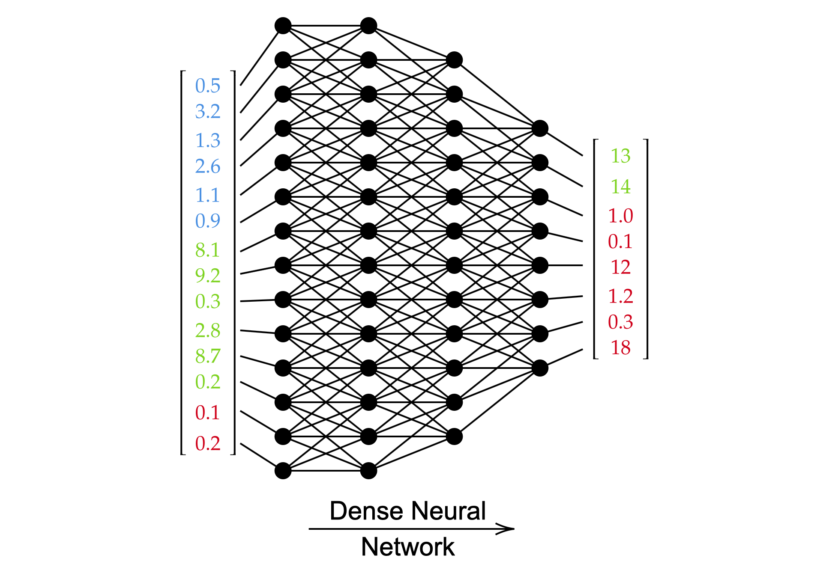

.. _fully-connected:

Fully Connected Neural Networks
===============================

We offer a Fully Connected Neural Network implementation, also called Multi-Layer Perceptron, that is
adapted to our H2MG data formalism described in the :ref:`data-formalism` section.

It vectorizes the input H2MG by concatenating the inputs located at the different hyper-edges.

.. note::

    In the case where the power grid topology does not vary in a dataset, using a Fully Connected may be more than
    enough. However, if the amount of nodes varies, or if there are some line disconnections or topology
    variations, then using a Fully Connected neural network is not the best option. In such a case, we
    strongly recommend to use a :ref:`h2mgnode`, which is a neural network architecture that was especially
    designed for this.

Process
-------

At first, the input data is vectorized, as shown in the figure below.

Then, a simple fully connected neural network is applied, and produces a vector output.

Finally, the vector is split and sent to the objects for which a prediction is required.

.. image:: ../figures/de_vectorization.png
  :width: 400

Usage
-----

Let us first define a power grid dataset and a dataloader, and sample a batch of data

.. code-block:: pycon

    import ml4ps as mp
    from torch.utils.data import DataLoader

    backend = mp.PandaPowerBackend()
    train_path = 'data/train'
    train_set = mp.PowerGridDataset(data_dir=train_dir, backend=backend)
    train_loader = DataLoader(train_set, batch_size=8, shuffle=True, collate_fn=mp.collate_power_grid)
    x, nets = next(iter(train_loader))

We may now initialize our fully connected model.

.. code-block:: pycon

    input_feature_names = {'gen': ['p_mw', 'vm_pu'], 'load': ['p_mw', 'q_mvar']}
    output_feature_names = {'bus': ['vm_pu']}
    fully_connected = mp.FullyConnected(x=x,
                                        input_feature_names=input_feature_names,
                                        output_feature_names=output_feature_names,
                                        hidden_dimensions=[64,64])

In this case, our model takes as input the active and reactive loads, the active power generations, and the
generator voltage set points. And it outputs voltage magnitudes at buses.
It has two hidden layers, respectively of dimensions 64 and 64.

In order to perform a prediction over a batch of data, we may do the following :

.. code-block:: pycon

    y_hat = fully_connected.apply(fully_connected.params, x)

Please refer to the :ref:`Use Case <usecase>` section for a comprehensive example on how to train our neural
network implementation.

Contents
--------
.. module:: ml4ps.neural_network.fully_connected
.. autoclass:: FullyConnected