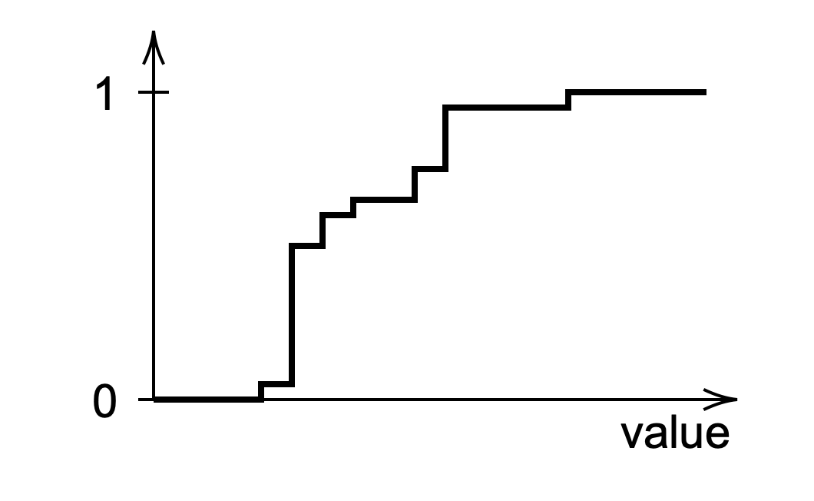
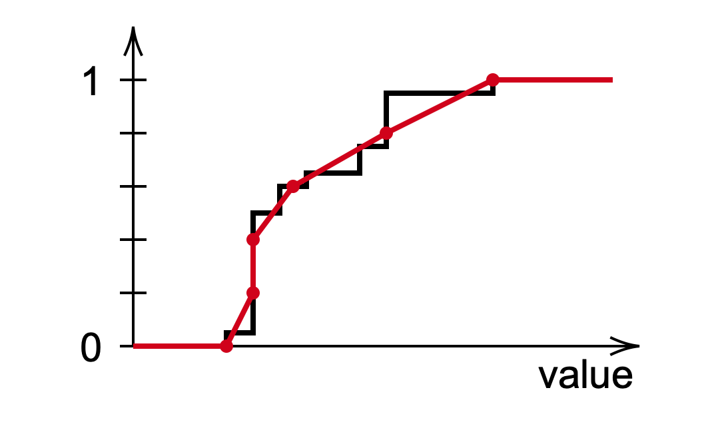

.. _normalization:

Normalization
=============

Neural networks can only work properly if your data is well distributed.
In most cases, a simple standardization (subtracting the mean and dividing
by the standard deviation) is more than enough.
However, data encountered in power grids is quite atypical and is very likely
to display multimodal distributions.

Moreover, we wish to have a normalization process that does not alter the
permutation-equivariance of the data. For more details about some properties
of our data, please refer to :ref:`Data Formalism <data-formalism>`.

Our data being composed of multiple instances of various classes (buses,
generators, loads, lines, etc.), we wish to have a normalizing mapping for
each class.
Even for a given class, there are multiple features that may be defined in
different units. For instance the active power of generators is usually
defined in MW, while the voltage setpoint of generators are usually defined
in p.u..
Those quantities being defined in different units, it would make no sense
to use the same normalizing mapping for all features.

To sum things up, we want to have a normalizing function for each feature
of each class.

.. note::

    One may argue that we could also use a different normalizing function
    for the different instances of a given class, the rationale being that
    two different generators may produce very different power orders of
    magnitudes for instance. Thus, using a separate normalizing function
    for each instance may also work.

    By doing so, we would actually break the permutation-equivariance of
    the data. If the neural network used is a simple fully connected
    architecture, then this may not have that much of an impact. But
    if we were to use a permutation-equivariant neural network architecture,
    then this would introduce a detrimental noise, which could prevent
    the neural network from learning anything meaningful.

??
--------------------------------------------------

If we take a look at the marginal distribution of a certain feature of a
certain class, we may observe some atypical and multimodal distribution.
In this case, standardization is not enough, and we are looking for another
way of sending this odd distribution to a more appropriate one.

.. image:: figures/distribution.png
  :width: 400

Fortunately, the CDF (Cumulative Derivative Function) provides by definition
an efficient way of converting our data to a uniform law over the interval
[0, 1].

Approximating the CDF
^^^^^^^^^^

First of all, we need to approximate the cumulative derivative function.

Resolving conflicts
^^^^^^^^^^

First of all, we need to approximate the cumulative derivative function.

Out of distribution extrapolation
^^^^^^^^^^

Since we only have access to a partial empirical distribution, it is very
likely that some values in the train and/or test sets will be out of the
range of observed values. If we took the actual CDF, then those values
would all be mapped to either 0 or 1 (depending if it is above or below
the range of observed values). This would prevent the neural network to
make a distinction between values that are out of range.

Thus, we propose to extrapolate by extending the first and last slopes.

.. image:: figures/extrapolation.png
  :width: 400

Usage
-----

.. code-block:: console

    x_norm = normalizer(x)

Advanced Options
----------------

If you want to do some fancy stuff, you can do this and this.

Contents
--------
.. module:: ML4PS.normalization
.. autoclass:: Normalizer
    :members: