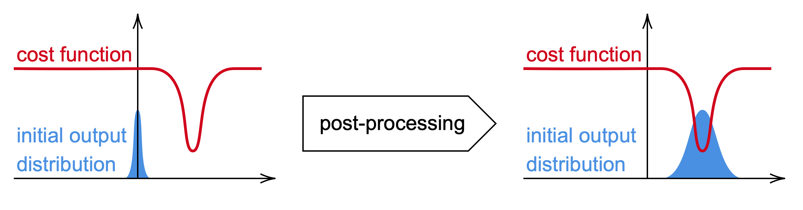

Post-Processing
===============

In many applications of Machine Learning, it is common to normalize the ground truth data,
so that the trainable approximator (e.g. a neural network) just has to learn to output values
that are more or less evenly distributed between -1 and 1.

In our power grid application, this may not always be possible. In the case where we want to plug
the output of a neural network directly into a power grid instance, so as to perform an AC Power
Flow simulation, then we want to plug values that are `physically meaningful` (i.e. that have the
right order of magnitude w.r.t. the units it is expressed in).

To give a concrete example, acting on voltage set points will require values that are more or less
in the interval 0.95 `p.u.` and 1.05 `p.u.`, while acting on active power generation will require
values that can be spread between 0 `MW` and 100 `MW`.

It is thus essential for our data processing pipeline to have a post-processing layer, right
after the neural network, so as to send outputs to the right order of magnitude.

Similarly to the normalization layer, it is essential that this mapping respects the
permutation-equivariance of the data. Thus, for each object and each feature which is output
by the neural network, we want a distinct normalizing function.

Post-processing to avoid convergence issues
-------------------------------------------

The choice of the post-processing function does not really matter from a purely theoretical point
of view. Indeed, a proper neural network can always learn to compensate the impact of a bad
post-processing function, so as to produce actually meaningful values.

Still, experience shows that a bad post-processing can completely hinder your training process,
by having you neural network getting stuck in bad local optima. One has to keep in mind that before
a training actually starts, a neural network is basically a random mapping. The initial distribution
of outputs can thus be controlled by the use of a post-processing layer. Scaling your output
down will have your model with extremely focused predictions, while scaling it up will have
it produce spread apart predictions.

Let us consider the case where we want to train a neural network to minimize a certain cost
function (in red in the figure below), which we assume to not depend too much on the input `x` .
Before the start of the training, the output of the neural network for different inputs `x` will
somewhat look like a normal distribution centered around zero.
If we were to start the training process from this initial guess, one can see that the gradient
is quite small, and that we can expect our neural network to take quite a lot of time to
reach the actual minimum.
In the case where we know a priori a better initial guess, we can use a post-processing function
to have our neural network start his training routine at a much better place (see the evolution
of the initial output distribution in blue in the figure below.

Still, one has to rely on its own understanding of the problem at hand to provide a post-processing
layer that provides a better initial guess.

It may be interesting for certain problems to force the output of a neural network to remain
in a certain range of values, using for instance a hyperbolic tangent mapping.

Provided Post-Processing Functions
----------------------------------

We provide implementations of basic mappings.
Users can define their own post-processing functions, as long as they are defined as
instances of a class, which then allows them to be saved and loaded.

.. module:: ml4ps.transform
.. autoclass:: AffineTransform
.. autoclass:: AbsValTransform
.. autoclass:: TanhTransform

Usage
-----

At first, one has to declare the different post-processing functions to be applied to each component.

.. code-block:: pycon

    import ml4ps as mp

    functions = {
        'gen': {'p_mw': [['tanh', {}], ['affine', {'slope':1e3}]],
        'load': {'q_mvar': [['affine', {'slope':1e3, 'offset':1e4}]]}
    }

    postprocessor = mp.PostProcessor(functions=functions)

In the example above, two transforms are applied sequentially to the feature `p_mw` of the objects
`gen` : the `tanh` first, and the `affine` second.

Then, the post-processor can be applied to any neural network output as follows :

.. code-block:: pycon

    y_post = postprocessor(y)

As it is a full-fledged component of out data processing pipeline, it can be saved as follows :

.. code-block:: pycon

    postprocessor.save('my_postprocessor.pkl')

It can be reloaded as follows :

.. code-block:: pycon

    postprocessor = PostProcessor(filename='my_postprocessor.pkl')

Contents
--------
.. autoclass:: PostProcessor
